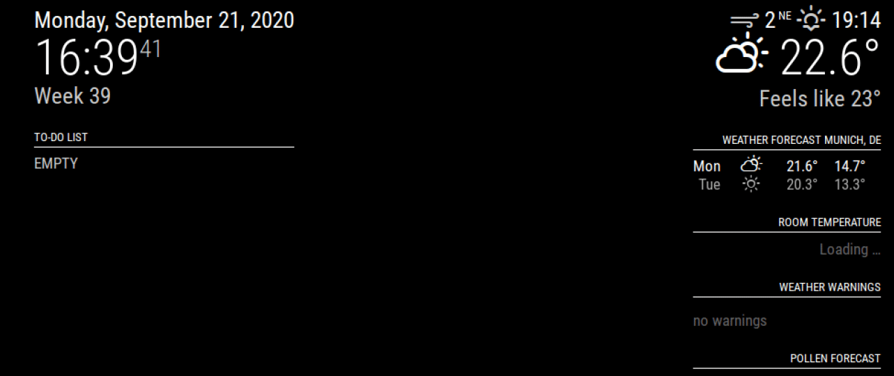

# This module is expansion from https://github.com/Klettner/MMM-StopwatchTimer

# Module: Pomodoro :hourglass_flowing_sand:
With this MagicMirror module you can display an alert-style timer or stopwatch on your mirror. The timer and stopwatch can be controlled via notifications or by using the [MM-Remote android app](https://github.com/Klettner/MM-Remote) :iphone:.  



## Dependencies ##
This module does not have any special dependencies.

## Set-up ##
This module can be downloaded by using Git. First make sure that you have installed Git on your system. 
Open the terminal/commandline and go to the modules directory of MagicMirror by typing
```
cd ~/MagicMirror/modules
```
Then clone this git repository:
```
git clone https://github.com/Klettner/MMM-Pomodoro.git
```
You can update this module by using
```
git pull
```
in the MMM-Pomodoro folder.
  
To use this module you also need to add it to the **config/config.js** file
```
modules: [
  {
    module: 'MMM-Pomodoro',
    config: {
      animation: true,
    },
  },
];
```
## Notification options ##
The following notifications can be used to control this module:
| **Notification** | **Description** |
|------------------|-----------------|
| ``` START_TIMER ``` | Starts a x-seconds timer. You need to specify the amount of seconds in the payload |
| ``` PAUSE_POMODORO ``` | Pauses the currently running timer or stopwatch. It will still be displayed on the screen |
| ``` UNPAUSE_TIMER ``` | If the timer was paused previously it will continue |
| ``` START_STOPWATCH ``` | The stopwatch starts running |
| ``` UNPAUSE_STOPWATCH ``` | If the stopwatch was paused previously it will continue |
| ``` INTERRUPT_POMODORO ``` | The mirror will stop displaying the timer or stopwatch which is currently shown |

## Configuration options ##
The following options can be configured in the config.js file:
| **Option** | **Description**|
|------------|----------------|
| ``` animation ``` | Controls if the timer/stopwatch should be animated. **Default:** *true* |
| ```longRelaxTime```     | Time for a long relaxation break (default: 30*60 seconds) |
| ```shortRelaxTime```    | Time for a short relaxation break (default: 5*60 seconds) |
| ```pomodoroTime```      | Duration of a pomodoro session (default: 25*60 seconds) |
| ```startArea```         | Defines the rectangular area for initiating the timer. Format: `{ x: 0, y: 0, width: 240, height: 240 }`. Touch or click within this area will start the timer. |
| ```togglePauseArea```   | Defines the rectangular area for toggling pause. Format: `{ x: 240, y: 0, width: 240, height: 240 }`. Touch or click within this area pauses or unpauses the timer/stopwatch. |
| ```interruptArea```     | Defines the rectangular area for interruption. Format: `{ x: 480, y: 0, width: 240, height: 240 }`. Touch or click within this area will interrupt the current session. |

Above options allow for intuitive touch or click control on devices with a touchscreen. The defined area coordinates determine which section of the interface responds to the respective control actions. These areas are *invisible*!

# Styling
The main styling is done with `ns-alert` - which being a German is a perculiar name for a css class... Below the default:
```css
.ns-alert {
  border-style: solid;
  border-color: #fff;
  padding: 17px;
  line-height: 1.4;
  margin-bottom: 10px;
  z-index: 3;
  color: white;
  font-size: 100%;
  position: unset;
  text-align: center;
  right: 0;
  left: 0;
  margin-right: auto;
  margin-left: auto;
  width: 30%;
  height: auto;
  word-wrap: break-word;
  border-radius: 20px;
}

.ns-alert:first-child {  // this makes sure that the buttons after the timer has run out are visible
  top: 40%;
}
```